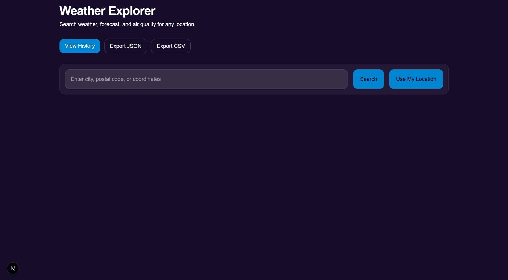
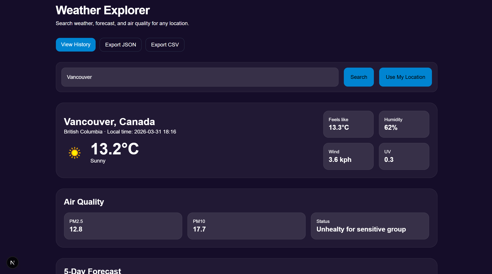
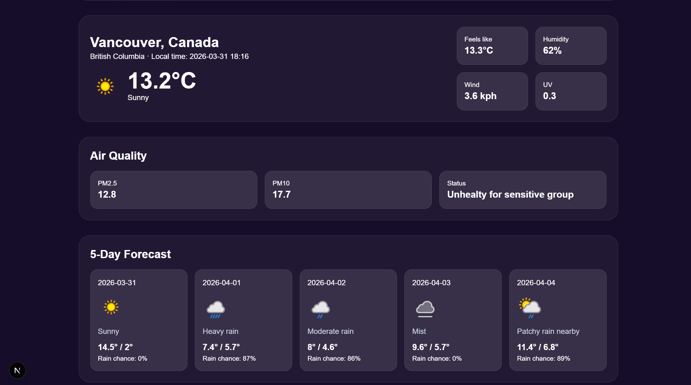
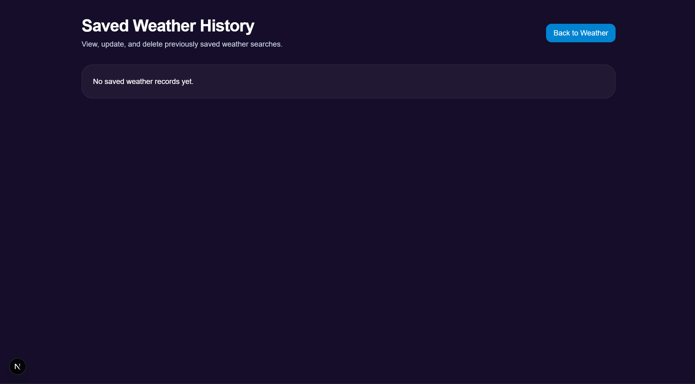
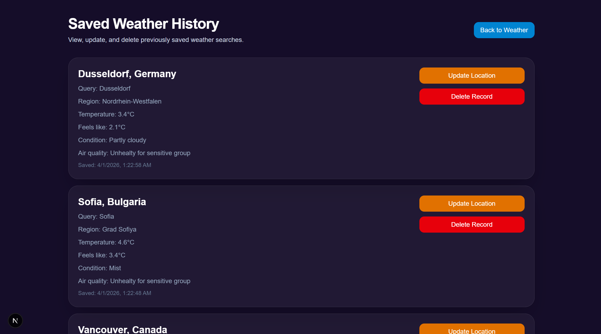

# Weather Explorer App

## Overview

Weather Explorer is a full-stack web application that allows users to search for real-time weather data, view air quality information, explore a 5-day forecast, and manage their search history.

The application combines a FastAPI backend with a Next.js frontend to deliver user-friendly interface.

---

## PM Accelerator Mission

By making industry-leading tools and education available to individuals from all backgrounds, we level the playing field for future PM leaders. This is the PM Accelerator motto, as we grant aspiring and experienced PMs what they need most – Access. We introduce you to industry leaders, surround you with the right PM ecosystem, and discover the new world of AI product management skills.

## Demo

- Frontend - weather-app-one-omega-44.vercel.app
- Backend API - https://weather-app-backend-mm6l.onrender.com

---

## Features

-  Search weather by city, postal code, or coordinates  
-  Use current location 
-  Real-time temperature and weather conditions  
-  Air quality data (PM2.5, PM10, status)  
-  5-day weather forecast  
-  Save and view search history  
-  Update saved locations  
-  Delete records  
-  Export data to JSON and CSV  

---

## Application Preview

### Main Page


### Weather Search



### History Page



---

## Tech Stack

### Frontend
- Next.js (React)
- TypeScript
- Tailwind CSS

### Backend
- FastAPI (Python)
- SQLAlchemy (ORM)
- SQLite (database)
- REST API architecture

### Deployment

- Vercel - frontend
- Render - backend

---

## Project Structure

```
weather_app/
├── backend/
│   └── app/
│        ├── routers/            # Handle API endpoints 
│        │   ├── export.py
│        │   ├── history.py
│        │   └── weather.py
│        ├── services/           # Logic and API integration
│        │   ├── air_quiality_service.py
│        │   └── weather_service.py
│        ├── crud.py 
│        ├── database.py 
│        ├── main.py        
│        ├── models.py            # Database table represented by python class
│        └── schemas.py           # Pydantic validation 
│
├── frontend/
│   ├── app/
│   │   ├── history 
│   │   │   └── page.tsx   # History page
│   │   ├── favicon.ico
│   │   ├── global.css
│   │   ├── layout.tsx
│   │   └── page.tsx       # Main page
│   │        
│   └──  public/
│   
│
├── screenshots/           # README images
└── README.md
```
---

## API Integration

The application integrates external weather APIs:

- WeatherAPI / OpenWeatherMap for:
  - Current weather
  - Forecast data
  - Weather conditions

- Air Quality API:
  - PM2.5
  - PM10
  - Air quality status

---

## Backend Functionality

The backend is built using FastAPI and includes:

### CRUD Operations

- **CREATE**
  - Save weather data for a location
  - Validate location and input

- **READ**
  - Retrieve weather history

- **UPDATE**
  - Update saved location

- **DELETE**
  - Remove records from database

---

## API andpoints And Data Export

- `/weather` - Get weather data
- `/history` - Get saved records
- `/history/{id}` - Update or delete record 

Users can export stored weather data:

- `/export/json` - Download JSON file  
- `/export/csv` - Download CSV file  

---

## Error Handling

Application includes:

- Invalid location handling  
- API failure handling
- User-frienly error messages
- Loading states  

---

## Installation & Setup

### 1. Clone the repository

```
git clone https://github.com/akozodoy/weather_app.git
cd weather_app
```

### 2. Backend Setup

```
cd backend
python -m venv venv
```

**Windows**

```
.venv\Scripts\activate
```

**Max/Linux**

```
source venv/bin/activate
```

### 3. Install dependecies and Run Backend

```
pip install -r requirements.txt
python -m uvicorn app.main:app --reload
```

Backend runs on:

```
http://localhost:8000
```

### 4. Frontend Setup

```
cd frontend
npm install
npm run dev
```

Frontend runs on:

```
http://localhost:3000
```
## Future Improvements

- Implement authentication
- Improve mobile UI
- Add map integration
- Dark/light mode
- Weather notifications
- Include more weather details

## Author

Anastasiia Chekanina Computer Science Student at University Of British Columbia